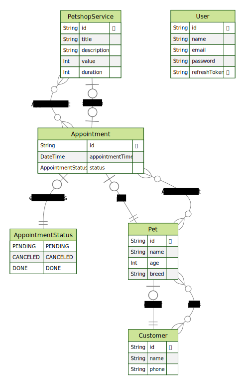

<h1>🐾PETSHOP🐾</h1>

Fictitious Petshop system, register customers, pets and services and easily manage appointments.

👉Check it out: https://petshop-system-project.vercel.app/ *

\* As explained in the website, this project uses free resources and hosting. Therefore, after a period of inactivity, the server shuts down and will automatically restart when accessed. This may take 1~3 MINUTES. Don't be surprised if the first request takes a while to load...

## 📜 About

   

As shown in the Entity Relationship Diagram above, the petshop system is very simple, we have a User which is responsible to perform all available actions (authenticate and CRUD other entities).

- The user can create, read, update and delete (CRUD) Customers and each Customer can have as many Pets as needed (CRUD options for Pets are available as well).
- The user can also CRUD Services that are used to schedule Appointments for a specific Pet
- User can also update the Appointment status, and filter Appointments by schedule date and status. Pagination and sorting were added as well.

Even though the scope of the project is not that big, I decided to follow coding best practices and also DDD patterns, which I know that is an overkill for a project this size, but I wanted to improve my knowledge on this topic.

Here are some features I added that I'm very proud of, wether because they were more advanced topics, or the end result was nice, or even because it looked good from the clean coding point of view (reusability, separation of concerns, etc):

- I added JWT authentication with refresh token logic
- For better UX I managed to add appointments filtering, pagination and sorting state to be stored in the URL of the client.
- I made everything look good and responsive to all devices.
- Backend code follows lots of DDD patterns
- Frontend with good looking and well structured design system
- API endpoints have clean and meaningful errors + validation DTOs

## 💻 Techs

- **Typescript** — A strongly typed programming language that builds on JavaScript
- **Day.js** — JavaScript date utility library

### 🌐 FRONTEND

- **Next.js** — React's framework
- **zustand** — A small, fast and scalable bearbones state-management solution using simplified flux principles
- **React Query** — Powerful asynchronous state management, server-state utilities and data fetching
- **tailwindcss** — Utility-first CSS framework
- **daisyUI** — The most popular component library for Tailwind CSS
- **zod** — TypeScript-first schema validation with static type inference
- **React Hook Form** — Performant, flexible and extensible forms with easy-to-use validation.

### ⚙ BACKEND

- **NestJS** — A Node.js framework for building efficient, reliable and scalable server-side applications.
- **MySQL** — Famous database management system that uses the SQL language
- **Prisma** — Next-generation Node.js and TypeScript ORM
- **Passport.js** — Simple, unobtrusive authentication for Node.js.
- **passport-JWT** — Passport authentication strategy using JSON Web Tokens
- **class-validator** — Decorator-based property validation for classes.

## 🛠 Getting started

1. Clone this repo running on your terminal `git clone https://github.com/Gust4voSales/petshop-project.git`
2. Inside the project `server` folder run `yarn` to install all dependencies
3. Create a `.env` file with with the `.example.env` file as model
4. Run `yarn prisma migrate dev` to apply the migrations to you db
5. Inside the project `client` folder run `yarn` to install all dependencies
6. Create a `.env` file with with the `.example.env` file as model
7. Run `yarn dev` in both folders to run in development mode
